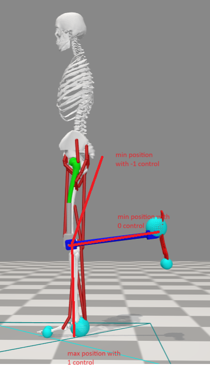

This project is development on the work of the robotics research lab ([github link](https://github.com/RoboticsLabRUG/Neuroprosthetics)).

To access the code, switch to branch 'ArmDev', and follow the readme of the Neuroprosthetics page which is listed below:


# Robotics Research Lab - OpenSim Reinforcement Learning Framework

This repository contains the OpenSim Reinforcement Learning framework customized for the research
in [Robotics Research Lab](https://www.roboticsresearchlab.nl/) at the University of Groningen.
This research is deeply inspired by NIPS 2017, NIPS 2018, and NIPS
2019 [challenges](https://osim-rl.kidzinski.com/docs/home/).

# Setting up your coding environment

Install [Anaconda](https://docs.conda.io/projects/conda/en/stable/) first.

Create a conda environment and install the requirements using the following commands

```commandline
conda create -n opensim -c conda-forge anaconda python=3.11
conda activate opensim
conda install -c opensim-org -c conda-forge opensim=4.4 simbody
pip install -r requirements.txt
```

At this point make sure that the numpy version installed is `numpy==1.25.2`, you can check with `pip freeze`.
If the version is different then please `pip uninstall numpy` and then `pip install numpy==1.25.2`

# Extra installation steps for Mac

If you are using a Mac, you will need to install the following packages:

```commandline
/bin/bash -c "$(curl -fsSL https://raw.githubusercontent.com/Homebrew/install/HEAD/install.sh)"
(echo; echo 'eval "$(/opt/homebrew/bin/brew shellenv)"') >> ~/.zprofile 
eval "$(/opt/homebrew/bin/brew shellenv)"
brew tap osrf/simulation
brew install simbody
ln -s /opt/homebrew/opt/simbody/libexec/simbody/simbody-visualizer.app ~/anaconda3/envs/opensim/bin//simbody-visualizer.app
```

This will install the simbody package and create a symbolic link to the simbody-visualizer.app in the conda environment.

# Environment

For this course we have adapted a new DRL environment, therefore this repository is relatively new. Whenever you
encounter an issue,
which you believe to be a problem within the code, please create an issue on the Github page (or email the TA),
such that these issues can be resolved for
everyone. [Neuroprosthetics Github Page.](https://github.com/rutgerluinge/Neuroprosthetics)

This code for this course is developed by A, Adriaenssens and R. Luinge.

# Installation Check

To test your environment and see if everything is set up correctly you should be able to run the following command
within
your Anaconda terminal (with the activated conda environment)

```Bash
python test_environment.py
```

This should show the 22 muscle model moving randomly.

# Running the various simulations

You can run the **experiments** with `python run_script.py`

- This will show a progress bar along the bottom of the terminal. The tensorboards will be written to the folder
  `./models/`, you can view it with `tensorboard --logdir ./models/`, then click the local host link in the output which
  will open a browser.

- Note: The `progress.csv` and the `PPO_X.zip` will be overwritten with every new run.
- `python run_script.py` contains many command line arguments which can be used to change the environment/learn parameters take a look in the code!
- Arguments can be given using: [argparse](https://docs.python.org/3/library/argparse.html)

You can run the **test/evaluation** with `python test_script.py`

- If you look into the file `test_script.py` you can see the which PPO model is being loaded. Make sure that the OpenSim
  environment has the same action space and observation space. You can use this to see the gaits a different points in
  the
  training, record a clip, and record the complete observation space. You should also write your results to either a csv or text file such that you can plot the gaits later!

# Documentation, libraries, APIs, and knowledge

This repository makes use of the [Stable-Baselines3](https://stable-baselines3.readthedocs.io/en/master/) code from
their [GitHub](https://github.com/DLR-RM/stable-baselines3).
It is highly recommend to read through their docs and get accustomed to their code base.

The environment and simulations use [OpenSim](https://simtk.org/projects/opensim). You should check out their website to
read through other projects, and download their [GUI](https://simtk.org/frs/?group_id=91). The GUI is super useful to
interact
with the musculoskeletal model, view motions, and test contact geometries. You should familiarise yourself with the
.osim
xml file and how to edit/interact with it.

The OpenSim module in Python has an [API](https://simtk.org/api_docs/opensim/api_docs/). This is how you will interface
with the OpenSim model. You can find all the documentation of the functions there related to Muscles, Managers, Contact,
etc...

The action space and observation space are handle by [Gymnasium](https://gymnasium.farama.org). If you wish to make
changes
such as `float` value action space then you can use [Box](https://gymnasium.farama.org/api/spaces/fundamental/#box).

[Optuna](https://optuna.org/) is great for hyperparameter optimization.

[Tensorboard](https://pytorch.org/tutorials/recipes/recipes/tensorboard_with_pytorch.html) is used
with [PyTorch](https://pytorch.org/docs/stable/index.html) for a super
handy tool to visualise what is going on during training.

# Repository Structure

- `models` - The saved data from training
- `osim` - The OpenSim environment
    - `models` - The musculoskeletal .osim models
        - `geometry` - The 3D objects to render in the environment
    - `osim.py` - The interface to the OpenSim environment *(you will be working here)*
- `stable_baselines3` - The algorithms provided by OpenAI *(you shouldn't need to touch)*
- `training_data` - The training data
    - `cmu83_35` - subject XX with movement YY from CMU Mocap library
    - `175` - directory including 175-FIX_vel.csv, a stable imitation data csv

# Prosthetic model - Tips

A few notes on the DRL architecture for running the prosthetic model:
Make sure to use the flag "prosthetic=True", this will use the prosthetic action space instead of the healthy action
space.

A few things about the action spaces:
The healthy action space is nice (simple) as it only gives 0's and 1's for the muscle control values, meaning no control
and full control respectively.

The prosthetic action space is formatted differently and predicts floating values between 0 - 1, and for the actuators
floats between -1 and 1. This makes it significantly harder to train, and get a walking model. To simplify the training
you could for example round the retrieved action to the nearest model before actuation, this could be done in the method
def actuate(self, actions: np.ndarray) -> None: . This would give a better gait, but also show some problems in the
actuators (cheating behaviour).

One solution to get a walking prosthetic model is to limit the range of the actuators control also to 0 or 1 (you can do
this by setting the prosthetic flag to False), this is efficient for learning, and would not hurt the performance for a
walking gait as the range is more than valid for a healthy gait, see the image down below.

Therefore, for a healthy gait using the prosthetic model we can simplify to use the same action space as the healthy
model. But ultimately we want to have more precise control values than only integer values, as this would be more
accurate and useful for a real life prosthesis. (as you do not always want a full contraction!)

Therefore, we encourage you to experiment also with the more profound action space with floating numbers, and
see if you can make this work instead! This would be a nice achievement for this course!


